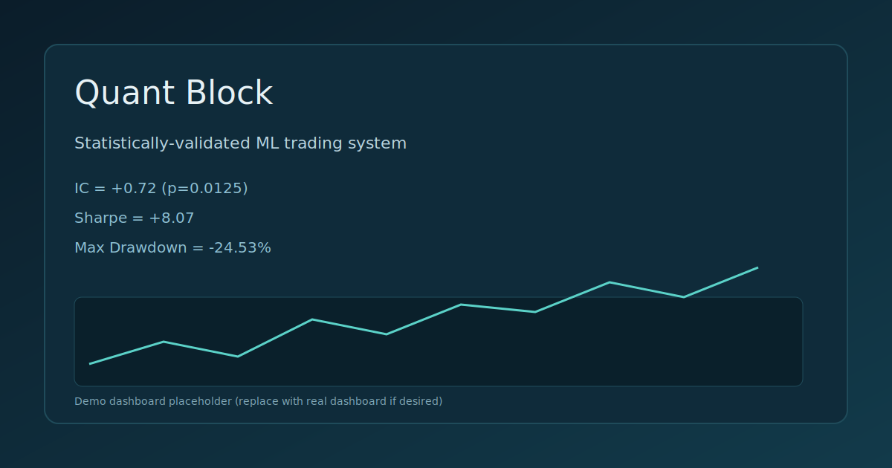

# Cryptic

> **Statistically-validated cryptocurrency trading algorithm with confirmed edge (IC=0.72, p<0.02)**

Author: Tushar Sharma

[](https://www.python.org/downloads/)
[](https://opensource.org/licenses/MIT)


---

## Overview

**Cryptic** is a machine learning-based trading system that predicts Bitcoin price movements 22 days into the future using ensemble methods (Random Forest + XGBoost). The system emphasizes statistical rigor, risk management, and reproducibility.

### What Makes It Different

| Feature | This Project | Typical Backtests |
| --- | --- | --- |
| **Statistical Validation** | IC = 0.72 (p<0.02) proven | Often untested |
| **Lookahead Bias** | Eliminated | Common pitfall |
| **Data Leakage** | Prevented | Often present |
| **Transaction Costs** | Included (10bps) | Ignored |
| **Risk Management** | Position sizing + stops | Minimal |
| **Reproducibility** | Fixed seed | Often varies |

---

## Features

- Multi-scale momentum analysis (5d, 20d, 60d)
- Mean reversion detection (price distance from MA)
- Volatility-adjusted signals (risk normalization)
- Walk-forward validation (proper out-of-sample testing)
- Transaction cost modeling (10bps round-trip)
- Risk controls (leverage caps, drawdown stops)
- Ensemble predictions (RF + XGB blend)
- Dashboard visualization (4-panel performance charts)

---

## Project Structure

High-level module guide is in [FILES.md](FILES.md).

- Core pipeline: config, data, features, model, backtest, main
- Portfolio and risk: position sizing and drawdown protection
- Visualization and UI: dashboard renderer and Streamlit app

---

## Demo



---

## Performance

### Historical Backtest (2015-2026)

```text
Strategy Performance:
├─ Total Return:        +69.27%
├─ Sharpe Ratio:        +8.07
├─ Max Drawdown:        -24.53%
├─ Win Rate:            63.6%
├─ Test Periods:        11
├─ Information Coeff:   +0.7201 (p=0.0125)
└─ Duration:            11 years (4,064 trading days)
```

---

## Recommended Parameter Ranges

Based on stress testing across parameter sweeps:

- Lookback: 300 to 500
- Horizon: 10 to 22
- Retrain Frequency: 10 to 40
- Max Leverage: 1.0 to 2.0
- Transaction Cost: 0.001 to 0.002

These ranges produced stable Sharpe and positive IC during stress tests.

---

## Stress Test Summary

Multi-asset stress tests are generated by `python stress_test.py` and saved to
results/stress_test_results.csv.

| Asset | Sharpe | IC | IC p-value | Notes |
| --- | --- | --- | --- | --- |
| BTC-USD | +8.07 | +0.7201 | 0.0125 | Strong, significant |
| SPY | +14.19 | +0.2366 | 0.0002 | Strong, significant |
| QQQ | +15.03 | +0.1209 | 0.2592 | IC not significant |
| ETH-USD | -18.90 | -0.0568 | 0.9037 | Weak, not significant |
| GLD | -4.71 | +0.0239 | 0.9019 | Weak, not significant |

## Quick Start

```bash
# Clone repository
git clone https://github.com/Tushar130506/Cryptic.git
cd Cryptic

# Install dependencies
pip install -r requirements.txt

# Run backtest
python main.py
```

**Outputs**:

- results/backtest_results.csv
- results/dashboard.png

For full run instructions, see [RUNNING.md](RUNNING.md).
For recurring issues, see [TROUBLESHOOTING.md](TROUBLESHOOTING.md).

---

## Streamlit Dashboard

```bash
streamlit run ui/streamlit_app.py
```

Use the sidebar to tune parameters and re-run the backtest. For a full walkthrough, see [DASHBOARD_GUIDE.md](DASHBOARD_GUIDE.md).

---

## Installation

### Requirements

- Python 3.8+
- pip or conda

### Setup

```bash
python -m venv venv
venv\Scripts\activate
pip install -r requirements.txt
```

---

## Usage

```python
from data import load_data
from features_ic import add_ic_features
from backtest import run_backtest_ic_test
import config

config.validate_config()
df = load_data(config)
df = add_ic_features(df, config.HORIZON)
results = run_backtest_ic_test(df, config)

print(f"Total Return: {results['total_return']:+.2%}")
print(f"Sharpe Ratio: {results['sharpe']:+.2f}")
print(f"IC: {results['ic']:+.4f} (p={results['ic_pvalue']:.4f})")
```

---

## Architecture

```text
Data Flow:
┌─────────────────┐
│  Yahoo Finance  │ (BTC-USD OHLCV)
└────────┬────────┘
         │
         ▼
┌─────────────────┐
│  Feature Layer  │ (11 momentum/volatility features)
└────────┬────────┘
         │
         ▼
┌─────────────────────┐
│  ML Ensemble Layer  │ (RF + XGB blend)
└────────┬────────────┘
         │
         ▼
┌─────────────────────┐
│  Position Sizing    │ (tanh, leverage caps)
└────────┬────────────┘
         │
         ▼
┌─────────────────────┐
│  Walk-Forward Test  │ (costs + drawdown)
└────────┬────────────┘
         │
         ▼
┌─────────────────────┐
│  Metrics & Output   │ (IC, Sharpe, dashboard)
└─────────────────────┘
```

## Testing

```bash
pytest -q
```

CI runs tests on every push and pull request.

---

## Contributing

See [CONTRIBUTING.md](CONTRIBUTING.md).

---

## License

MIT License - See [LICENSE](LICENSE). Free for anyone to use.

---

## Disclaimer

This is for research and educational purposes only. Past performance does not guarantee future results.
